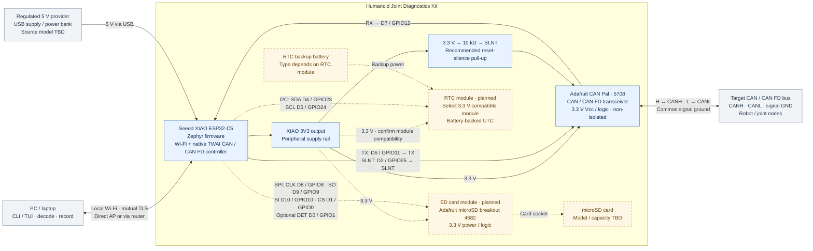

# Hardware block diagram

Solid connections show the current design. Dashed connections show planned optional SD/RTC additions. Physical hardware validation is pending.

- CAN Pal is a transceiver; the CAN controller is inside the ESP32-C5. No separate SPI CAN controller or level shifter is used.
- SLNT high inhibits physical transmission. The recommended 10 kΩ pull-up goes to the same 3.3 V rail as CAN Pal Vcc; reset behavior still needs measurement.
- Enable the CAN Pal's 120 Ω termination only if it is one of the bus's two endpoints. Leave it off when tapping an already terminated bus.
- USB supplies power and supports flashing/debug; operational communication uses Wi-Fi. The kit does not power the target actuators.
- The 5 V provider feeds the XIAO through USB. Peripheral power comes from its 3V3 output; verify available current under combined Wi-Fi, CAN and SD load before finalizing the supply. The diagram shows one USB power source at a time.
- Join XIAO, CAN Pal, SD and RTC grounds to the supply return and appropriate CAN signal ground. Ground wiring is omitted from individual power arrows for readability.
- SD and RTC interfaces are reserved in the roadmap and currently disabled in the firmware overlay. SPI labels SO/SI refer to the SD breakout. RTC module, supply compatibility and backup battery remain undecided.

Sources: [wiring and reset behavior](wiring.md), [hardware roadmap](roadmap.md#2-hardware-and-reserved-interfaces), and [firmware pin configuration](../firmware/boards/xiao_esp32c5_esp32c5_hpcore.overlay).
