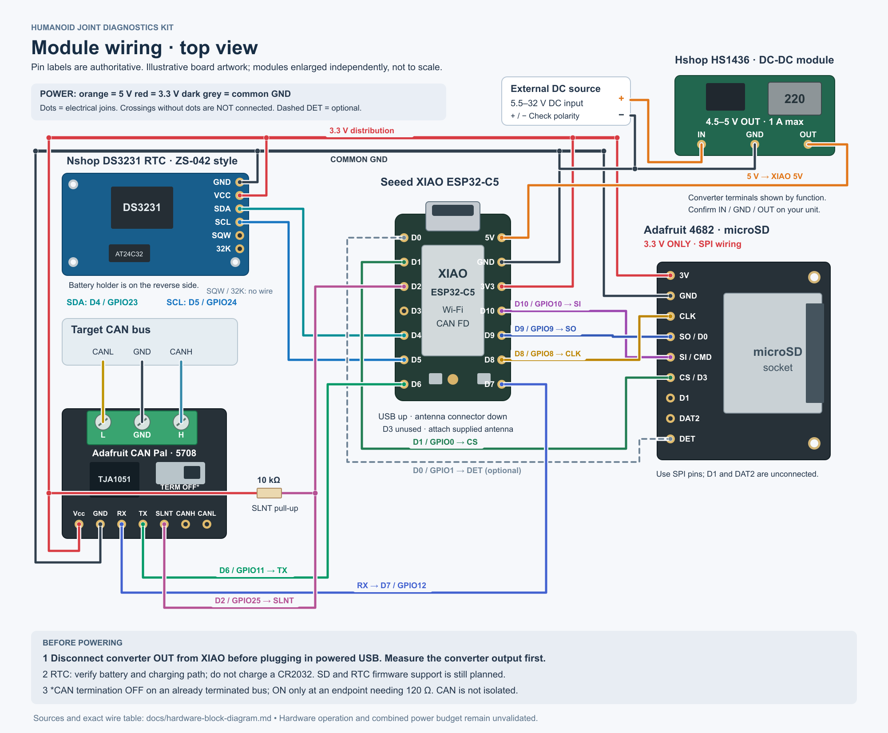
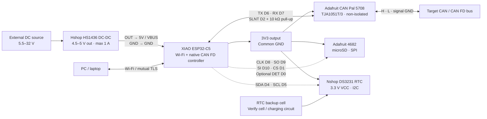

# Hardware block diagram

Updated 2026-09-19 for the five modules selected by the user. The drawing shows proposed physical wiring, including the planned SD and RTC extensions. **Hardware operation and the combined power budget are not yet validated.** No firmware support is implied by connecting the modules.

## Top-view wiring picture



[Open full-size PNG](images/hardware-wiring.png) · [Zoomable SVG](images/hardware-wiring.svg)

The boards are illustrations based on vendor photos and pin maps, enlarged independently for readability. The XIAO is USB-up; the SD board is rotated 90° clockwise from Adafruit's socket-up photo; the RTC is shown from its component side with the six-pin header on the right. **Match printed pin names, not wire position alone.** The converter's three terminals are shown by function because the seller does not provide an unambiguous numbered pinout. Confirm its IN, GND and OUT markings on the actual unit.

Orange is the converter output, red is 3.3 V, and dark grey is common ground. Dots mark joins; crossing lines without dots are not connected. The dashed card-detect wire is optional. Signal colours distinguish individual connections, not standard cable colour assignments.

## Selected modules

| Module | Specification used for this wiring | Source |
|---|---|---|
| Seeed Studio XIAO ESP32-C5 | 5V/VBUS input; 3V3 output; native CAN controller and the GPIO assignments below | [Selected product](https://www.seeedstudio.com/Seeed-Studio-XIAO-ESP32C5-p-6609.html), [Seeed pin map](https://wiki.seeedstudio.com/xiao_esp32c5_getting_started/) |
| Adafruit CAN Pal 5708 | TJA1051T/3 transceiver; power at the MCU's logic voltage, 3.3 V here; internal transceiver supply generation; switchable 120 Ω termination | [Product](https://www.adafruit.com/product/5708), [pinouts](https://learn.adafruit.com/adafruit-can-pal/pinouts) |
| Adafruit microSD breakout 4682 | **3.3 V power and logic only**; no regulator/level shifters; use SPI, not SDIO, for this design | [Product](https://www.adafruit.com/product/4682), [pinouts](https://learn.adafruit.com/adafruit-microsd-spi-sdio/pinouts) |
| Nshop DS3231 module, SKU 6W68 | Seller specifies 3.3–5.5 V, I2C up to 400 kHz, AT24C32 EEPROM; pictured ZS-042-style module. Use 3.3 V VCC here | [Selected module and photos](https://nshopvn.com/product/module-thoi-gian-thuc-rtc-ds3231/), [DS3231 manufacturer datasheet](https://www.analog.com/media/en/technical-documentation/data-sheets/DS3231.pdf) |
| Hshop DC-DC Power Supply 5VDC 1A, SKU HS1436 | Seller specifies **5.5–32 V DC input, 4.5–5 V DC output, maximum 1 A**; it is a step-down converter, not a battery or USB supply | [Selected power module](https://hshop.vn/mach-cap-nguon-dc-dc-power-supply-5vdc-1a) |

## Wire-by-wire connections

### Power

| From | To | Purpose |
|---|---|---|
| External DC source positive | Converter IN | Source must stay within the stated 5.5–32 V range, including transients |
| External DC source negative | Converter GND | Input return |
| Converter OUT | XIAO **5V / VBUS** | External power input; measure output before connection |
| Converter GND | XIAO GND | Common ground |
| XIAO 3V3 | CAN Pal Vcc | 3.3 V logic/power |
| XIAO 3V3 | SD module **3V** | Never connect this pin to 5 V |
| XIAO 3V3 | RTC VCC | Keeps its supply and VCC-referenced I2C pull-ups at 3.3 V |
| XIAO GND | CAN Pal GND, SD GND, RTC GND | Join all peripheral returns |
| XIAO 3V3 | **10 kΩ resistor**, then CAN Pal SLNT | Recommended reset-silence bias, in addition to the D2 wire |

Use a small distribution connector or soldered power/ground junctions for the branches. The converter's 1 A rating is **not** a guarantee of 1 A available at the XIAO's 3V3 output. Verify converter voltage, wiring drop, XIAO supply limits and peak load during simultaneous radio activity and SD writes. A 48 V robot battery is outside this converter's stated input range.

This drawing uses external power through the 5V pin. **Disconnect converter OUT from the XIAO before plugging in a powered USB cable** for flashing/debugging; simply switching off the upstream source does not establish reverse-current isolation. A qualified power-selection circuit is a separate design. Seeed's [C5 power schematic](https://files.seeedstudio.com/wiki/XIAO_ESP32C5/res/Seeed_Studio_XIAO_ESP32C5.pdf) is revision-specific; its power circuitry must not be generalized to an unidentified board revision. Leave the XIAO battery pads unused in this arrangement.

### CAN transceiver

| XIAO / bus | CAN Pal pin | Function |
|---|---|---|
| D6 / GPIO11 | TX | MCU CAN transmit output → transceiver input |
| D7 / GPIO12 | RX | Transceiver receive output → MCU CAN input |
| D2 / GPIO25 | SLNT | High disables the transmitter |
| Target CANH | Terminal **H** | CAN high |
| Target CANL | Terminal **L** | CAN low |
| Target signal ground | Middle terminal, between L and H | Common signal ground |

With the terminal block above the board, the logic header is **Vcc, GND, RX, TX, SLNT, CANH, CANL** from left to right. The drawing uses the terminal block for the bus; the duplicate CANH/CANL header holes remain unused. TX connects to TX and RX to RX—these are not crossed as UART wires. CAN Pal is not galvanically isolated. Use a short CANH/CANL twisted pair and a short tap stub. Keep termination **OFF** on an already terminated bus; turn it **ON** only when the module supplies one of its two endpoint terminations. See [reset-silence details](wiring.md#reset-time-protection).

### microSD module

| XIAO | SD breakout label | Function |
|---|---|---|
| D8 / GPIO8 | CLK | SPI clock |
| D9 / GPIO9 | SO / D0 | Card output → MCU MISO |
| D10 / GPIO10 | SI / CMD | MCU MOSI → card input |
| D1 / GPIO0 | CS / D3 | Active-low chip select |
| D0 / GPIO1, optional | DET | Card detect |

With the socket above the header in the vendor photo, the pads run **3V, GND, CLK, SO/D0, SI/CMD, CS/D3, D1, DAT2, DET** from left to right. Leave the breakout's **D1 and DAT2** unconnected in SPI mode; SD D1 is not XIAO D1. Adafruit documents DET low with no card and high with a card, with an onboard 4.7 kΩ pull-up. Exact card model and capacity remain undecided.

### RTC module

| XIAO | RTC header label | Function |
|---|---|---|
| D4 / GPIO23 | SDA | I2C data |
| D5 / GPIO24 | SCL | I2C clock |
| No connection | SQW, 32K | Alarm/square-wave outputs are unused |

Power and ground are listed above. The pictured six-pin header, on the **left** of the component side in Nshop's photo, reads **32K, SQW, SCL, SDA, VCC, GND** from top to bottom. The drawing rotates that board so the header is on the right. Use one header; the four-pad header duplicates the I2C/power connections. DS3231 uses 7-bit address `0x68`; do not mistake the board's EEPROM for the RTC. Verify the actual board's SDA/SCL pull-ups return to 3.3 V.

**Battery circuit needs inspection.** Nshop's text calls a CR2032 rechargeable, while its photos show both CR2032 and LIR2032 cells. CR2032 is a primary, non-rechargeable cell; see [Panasonic's CR2032 datasheet](https://energy.panasonic.com/dam/master/pdf/en/datasheet/lithium/CR2032_Datasheet_EN_240701.pdf). The DS3231 chip has a backup input, but that does not certify the breakout's charging circuit. Bring up the module without a coin cell first. Fit a CR2032 only after any charging path on the actual board is positively disabled; a LIR2032 also requires a suitable verified charging arrangement. Powering VCC from 3.3 V alone is not a verified battery-safety guarantee. The backup cell powers RTC timekeeping, not the kit.

## Functional block diagram

Dashed links below mean **planned firmware support**, rather than optional physical wires.



## Implementation status and artwork

The [current overlay](../firmware/boards/xiao_esp32c5_esp32c5_hpcore.overlay) enables CAN on GPIO11/12 and SLNT on GPIO25. SPI and I2C remain disabled. The GPIO reservations above match the [roadmap](roadmap.md#2-hardware-and-reserved-interfaces); this documentation does not enable SD logging or the RTC. USB remains a flashing/debug interface, not operational transport. Attach the XIAO's supplied antenna for wireless operation.

The editable diagram is generated by [hardware_wiring.py](../tools/diagrams/hardware_wiring.py), with no external Python packages. Regenerate from the repository root with:

```sh
python3 tools/diagrams/hardware_wiring.py
rsvg-convert -o docs/images/hardware-wiring.png docs/images/hardware-wiring.svg
```

The artwork is an original vector illustration; source photos are referenced for orientation, not embedded in the repository.
