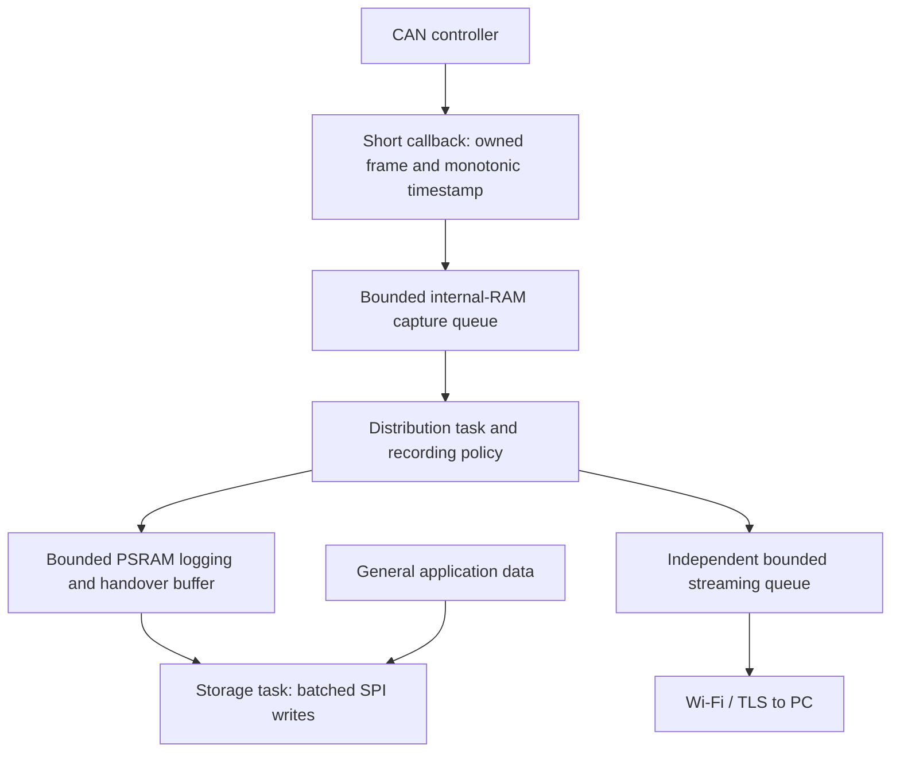
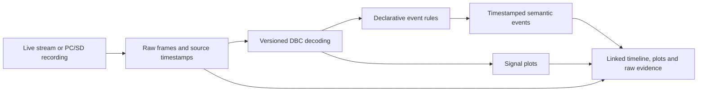

# Product roadmap

Updated 2026-09-17. This is the consolidated plan for the agreed product direction; linked issues hold implementation acceptance criteria. It does **not** describe all features as available today. Setup remains in [getting-started.md](getting-started.md), with current evidence in [testing.md](testing.md).

## 1. Purpose and current baseline

Capture raw CAN/CAN FD traffic, preserve reliable evidence, and use a DBC plus explicit event definitions to understand what happened over time. Bike power-on and riding-mode events are examples; no bike, actuator family or vendor protocol has been selected. Processing stays local, with no cloud requirement.

| Area | Current state | Next outcome |
|---|---|---|
| Firmware | Zephyr C5 image builds; Classical/FD capture, finite explicit TX and loss accounting implemented | Qualify on physical hardware |
| Connectivity | Mutual TLS; AP/Station and selectable 2.4/5 GHz implemented | Verify radio operation and runtime margins; country restrictions remain |
| PC | CLI/TUI, DBC decode/encode library, PC recording, offline playback and CSV | Recording health acknowledgements, SD import and semantic analysis |
| Storage | PC JSONL only; SPI/PSRAM storage path disabled | Optional microSD logging and general-data storage |
| Calendar time | Monotonic device and separate PC receipt timestamps; no external RTC | Optional battery-backed UTC with explicit validity |
| Semantic view | No event-rule engine or synchronized plots | Timestamped events, signal plots and linked raw evidence |
| Validation | Last recorded suite: 126 automated tests passing; no physical hardware tests | Measured operating envelope, not a blanket lossless claim |
| External UI | Bounded adapter interface only | Candidate selection/compatibility verification later |

The pinned Zephyr is a development snapshot. Internal SRAM link allocation is 91.44%; PSRAM/runtime margins are not yet qualified. The 5 GHz implementation conservatively rejects country codes outside the pinned HAL's documented list, including Indonesia (`ID`); this requires verification/update, not substitution of another country. See [limitations](limitations.md) and [Wi-Fi setup](wifi-setup.md).

## 2. Hardware and reserved interfaces

| Component | Selection/status | Interface and allocation |
|---|---|---|
| Processor | XIAO ESP32-C5, available per user | Zephyr; USB only power/flashing/debug |
| CAN | Adafruit CAN Pal 5708, available per user | TX D6/GPIO11; RX D7/GPIO12; SLNT D2/GPIO25 |
| SD breakout | Adafruit 4682 selected; possession/testing unconfirmed | SPI: CLK D8/GPIO8, SO D9/GPIO9, SI D10/GPIO10, CS D1/GPIO0 |
| Card detection | Optional | DET D0/GPIO1; verify exact breakout behavior |
| microSD card | Exact model/capacity pending | Qualify filesystem, sustained writes, write pauses and endurance |
| RTC breakout | User will select module | Proposed I2C SDA D4/GPIO23, SCL D5/GPIO24; no alarm pin reserved |
| Reference CAN equipment | Availability unconfirmed | Known numbered source and ACK-capable peer for physical tests |

The SD breakout requires 3.3 V power/logic; native SPI is the selected card interface. Qualify a 20 MHz operating target after low-speed initialization; it is not a throughput guarantee. Check power headroom, wiring, signal integrity and combined Wi-Fi/CAN/SD load. RTC voltage, pull-ups, address, battery/charging circuit and Zephyr driver remain selection gates. Keep CAN termination, grounding and reset-silence requirements in [wiring.md](wiring.md).

References: [SD breakout](https://www.adafruit.com/product/4682), [SD pinouts](https://learn.adafruit.com/adafruit-microsd-spi-sdio/pinouts), [XIAO pin map](https://wiki.seeedstudio.com/xiao_esp32c5_getting_started/). These are selected/proposed connections, not a hardware validation report.

## 3. Recording policy

**While an explicitly started capture runs, record on SD unless a healthy authenticated PC recorder has accepted recording ownership.** Router connection alone is insufficient.

| Situation | Stream to PC | PC records | SD records |
|---|---|---|---|
| PC recorder ready with acknowledged progress | Yes | Yes | No, except bounded handover overlap |
| PC viewing only | Yes | No | Yes |
| No PC connection | No | No | Yes |
| PC recorder stops, fails, freezes or disconnects | If possible | Off/unhealthy | Resume |
| No healthy PC recorder and SD unavailable/full | If possible | No | No; expose unprotected recording and losses |

Planned state machine: STOPPED, SD_LOGGING, PC_RECORDING, HANDOVER and STORAGE_UNAVAILABLE/ERROR. It must distinguish no CAN traffic from a stalled recorder.

- PC readiness follows successful output creation. Progress acknowledgements reference frame sequences after the specified persistence operation, not TCP receipt or rendering. Define sync cadence and distinguish OS acknowledgement from physical power-loss guarantees.
- Retain bounded unacknowledged history for handover. If the recorder stalls or retention fills, start SD fallback and report any uncovered interval; an ordinary connection heartbeat is not enough.
- Permit a short overlap to avoid a transition gap. Identify/deduplicate records by device, boot session, channel and sequence; retain ordering, gaps and both sources' metadata.
- Disconnect/lease loss cancels TX and returns the controller to listen-only while requested passive logging continues. Reconfiguration may cause a gap and must be accounted for. **Today disconnect stops capture; this change is planned.**
- Boot stays stopped with TX disabled. Standalone logging means continuing an explicitly started capture after PC disconnection. Persistent auto-start or a new physical start control needs a separate explicit decision; it is not implied here.
- Display filters never silently change recording. Never automatically resend uncertain commands or replay recordings onto CAN.

## 4. Firmware data path and storage

A destructive shared queue cannot deliver the same frames to both consumers. Use explicit per-output ownership. CAN callbacks never wait for filesystem/network operations or access unqualified PSRAM paths. Slow SD and Wi-Fi consumers have separate loss accounting; UI refresh loss is another category.

Enable and qualify PSRAM first. A 1–2 MiB buffer is a starting design target, subject to actual memory/driver support and measured pause lengths. Internal RAM staging may be required for DMA. No buffer can cover unlimited outages.

Plan a versioned compact SD format with chunk integrity checks, raw frames, status/loss/configuration, TX events and clock anchors. Define rotation, flush/sync cadence, partial-tail recovery, safe removal and reinsertion. Never autoformat or silently overwrite unrelated files. General application data uses separate directories and bounded lower-priority writes; its specific schemas are still unspecified. Initial SD import uses a PC card reader; wireless file transfer is not required.

The existing [PC JSONL v1 format](recording-format.md) remains the current implementation. New SD/time/event metadata requires explicit versioning and compatibility tests rather than undocumented changes to v1.

## 5. RTC and time semantics

SD reads/writes do not require an RTC. The optional battery-backed RTC supplies UTC for filenames and recording metadata when valid.

- Read/validate the RTC at startup and anchor UTC to device monotonic time; no per-frame I2C reads.
- Keep raw frame timing monotonic. Current callback timestamps have 1 ms resolution expressed in microseconds; the RTC does not improve this.
- Record source, validity, available precision and clock adjustments. Backward/forward calendar corrections create new anchors, never reorder/rewrite recorded frames.
- Support explicit authenticated PC time setting without requiring internet/NTP. Show calendar time only when trustworthy; keep PC receipt time separate.
- With absent/unset/failed RTC, continue logging using session/segment identities and relative time. Expose unknown UTC; do not manufacture a valid date.

RTC implementation waits for the user's breakout selection; recording format and time-state design can proceed first.

## 6. From CAN traffic to an event timeline

The DBC defines message/signal decoding, scaling and enumerations. A separate rule file defines meaning: transitions, thresholds, hysteresis, debounce/dwell and combinations of fresh signals. No arbitrary executable rules or automatically inferred vendor command semantics.

Illustrative examples, **not actual device definitions**:

| Observation | Possible configured event |
|---|---|
| Observed PowerState OFF then ON | Bike turned on |
| Observed OperatingMode IDLE then RIDE | Entered riding mode |
| Speed crosses a configured movement threshold | Movement detected |
| FaultCode changes from zero to a defined fault | Fault reported |

A first observation of ON means “first observed powered on,” not a proven power-on transition. Missing frames, stale prerequisites, decode failures and session boundaries make some transitions unknown. Long intervals alone do not prove a fault. Rules must define occurrence versus debounce-confirmation time and include evidence frame references.

Preserve raw recordings and produce derived events separately. Capture DBC/rule versions or hashes, rule IDs, relevant values, source device/session/channel/sequences, timestamps and uncertainty. Reprocessing the same data with the same versions should be deterministic. Vendor DBCs require permission before public redistribution.

The PC view should provide live/offline timelines, selected signal plots, event selection revealing raw evidence, relative/UTC axes, visible gaps and bounded independent UI refresh. Plot decimation cannot alter event evaluation or recordings. Seeking must restore rule context or mark state unknown. Local playback/export never transmits onto CAN.

Visualization technology remains to be selected in its issue. Preserve the CLI/TUI; a full desktop GUI is not required. SavvyCAN/Foxglove remain candidates, not verified integrations. This feature explains observed state changes; automatic root-cause diagnosis remains out of scope.

## 7. Delivery sequence and issue map

No calendar commitments are set; progress is gated by evidence and hardware availability.

| Phase | Deliverable / exit gate | Issues |
|---|---|---|
| A: qualify baseline and hardware | Boot/AP/TLS/CAN baseline, SD electrical/SPI bring-up, PSRAM/runtime margins | [#1](https://github.com/bluleap-ai/Humanoid-Joint-Diagnostics-Kit/issues/1), [#2](https://github.com/bluleap-ai/Humanoid-Joint-Diagnostics-Kit/issues/2), baseline checks in [#6](https://github.com/bluleap-ai/Humanoid-Joint-Diagnostics-Kit/issues/6) |
| B: standalone evidence | Versioned SD writer/general data, valid/unknown UTC handling, imported SD reading | [#3](https://github.com/bluleap-ai/Humanoid-Joint-Diagnostics-Kit/issues/3), [#8 RTC](https://github.com/bluleap-ai/Humanoid-Joint-Diagnostics-Kit/issues/8), [#5](https://github.com/bluleap-ai/Humanoid-Joint-Diagnostics-Kit/issues/5) |
| C: recording handover | PC recording acknowledgements, bounded failover, independent streaming | [#4](https://github.com/bluleap-ai/Humanoid-Joint-Diagnostics-Kit/issues/4), [#5](https://github.com/bluleap-ai/Humanoid-Joint-Diagnostics-Kit/issues/5) |
| D: event analysis | Reusable rule engine, linked timeline/plots and synthetic/reference validation | [#9](https://github.com/bluleap-ai/Humanoid-Joint-Diagnostics-Kit/issues/9), [#10](https://github.com/bluleap-ai/Humanoid-Joint-Diagnostics-Kit/issues/10), [#11](https://github.com/bluleap-ai/Humanoid-Joint-Diagnostics-Kit/issues/11) |
| E: combined qualification | Measured logging/streaming envelope and fault/clock/transition results | [#6](https://github.com/bluleap-ai/Humanoid-Joint-Diagnostics-Kit/issues/6), [#11](https://github.com/bluleap-ai/Humanoid-Joint-Diagnostics-Kit/issues/11) |

[#7](https://github.com/bluleap-ai/Humanoid-Joint-Diagnostics-Kit/issues/7) tracks SD/RTC integration. Event work can begin with synthetic and existing PC recordings while SD/RTC hardware is pending; its SD import/time integration depends on the corresponding contracts. RTC absence must not block basic logging.

## 8. Validation and open decisions

Automated checks must exercise ownership/leases, failed PC writes/syncs, frozen recorders, card errors, bounded queues, overlap, partial files, time validity/corrections, initial event state, stale signals, gaps, deterministic live/offline evaluation and slow UI consumers.

Physical qualification must use numbered CAN payloads and record source counts, exact firmware/card/router/bus setup, throughput, worst observed pauses, queue high-water, per-layer losses and runtime memory. Test standalone SD, SD plus Wi-Fi viewing, PC recording with SD idle and overlapping handover, plus power/card/network/recorder failures. No successful hardware tests or zero-loss envelope are claimed today.

Pending inputs/decisions:

- RTC breakout and safe backup battery, exact microSD model/capacity and reference CAN equipment.
- Actual authorized DBC, device/firmware version and semantic event definitions.
- Acceptable power-loss window, retention/overwrite policy, final queue sizes and recorder lease/sync intervals after measurement.
- Visualization technology and any separately verified external-tool adapter.
- Project license before describing the release as open-source licensed; production security and stable Zephyr qualification remain separate follow-up work.

Still excluded: second CAN channel, USB operational transport, cloud, CAN replay, OTA-to-CAN flashing, bootloader/actuator-specific diagnostics and automatic root-cause diagnosis. SD/RTC and semantic visualization are agreed extensions to the original V1 deferrals, not completed features.
